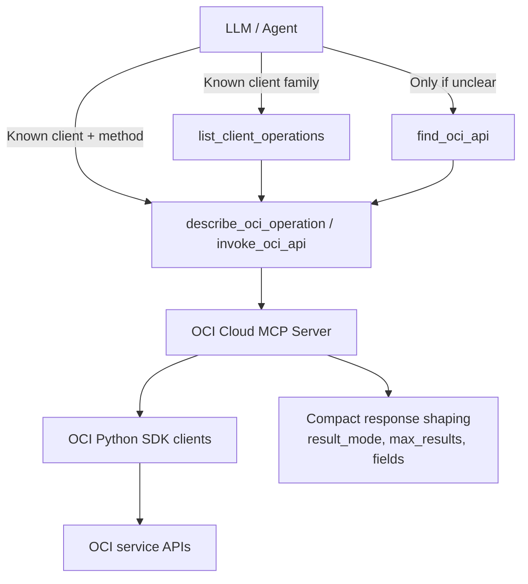

# OCI Cloud MCP Server

## Overview

This server is a thin wrapper over the official OCI Python SDK (no OCI CLI subprocess calls). Think in SDK terms: `client class -> method -> kwargs`.
Discovery is SDK-first, with thin keyword/resource-action fallback search when you genuinely cannot infer the client or method.

It exposes generic tools that let you:
- List OCI SDK clients available in the current environment
- Search for the right OCI client operation by short keyword/resource-action search
- Inspect the exact contract of an SDK method before calling it
- Invoke any OCI SDK client operation by fully-qualified client class and method name
- Discover available operations for a given OCI client

Recommended low-token workflow:
1. If you already know the SDK client class and method, call `describe_oci_operation` or `invoke_oci_api` directly.
2. If the service family is already obvious, call `list_client_operations` on that client class first.
3. Otherwise, call `find_oci_api` only as a thin escape-hatch fallback with a short SDK-oriented resource/action query like `"list regions"` or `"create vcn"` rather than a full sentence. Keep `limit` small (`3-5`) on the first discovery call.
4. Call `describe_oci_operation` for the chosen `client_fqn` + `operation` when you need parameter details.
5. Call `invoke_oci_api`. Its default `result_mode="auto"` keeps list, summarize, and paginated results compact. Use `result_mode="full"` only when you need the full payload, and prefer `fields` when you only need a few exact top-level values.
6. Call `list_oci_clients` only for capability discovery/debugging, or when search is ambiguous.

## Architecture



## Running the server

### STDIO transport mode

```sh
uvx oracle.oci-cloud-mcp-server
```

### HTTP streaming transport mode

```sh
ORACLE_MCP_HOST=<bind_host> \
ORACLE_MCP_PORT=<port> \
ORACLE_MCP_BASE_URL=<public_base_url> \
OCI_REGION=<region> \
IDCS_DOMAIN=<idcs_domain> \
IDCS_CLIENT_ID=<client_id> \
IDCS_CLIENT_SECRET=<client_secret> \
IDCS_AUDIENCE=<audience> \
uvx oracle.oci-cloud-mcp-server
```

Register `${ORACLE_MCP_BASE_URL}/auth/callback` in the OCI IAM confidential application. If `IDCS_REQUIRED_SCOPES` is unset, the default is `openid profile email oci_mcp.cloud.invoke`. `stdio` uses the configured OCI CLI profile; HTTP uses the authenticated OCI IAM user.

## Tools

| Tool Name | Description |
| --- | --- |
| list_oci_clients | List OCI SDK clients discoverable in the current environment; best for capability discovery/debugging. |
| find_oci_api | Thin fallback keyword/resource-action search across OCI SDK client methods and return compact matches with `client_fqn` + `operation`. |
| describe_oci_operation | Describe a specific OCI SDK method, including required params, optional params, pagination behavior, aliases, and request model hints. |
| invoke_oci_api | Invoke an OCI Python SDK client method via `client_fqn` + `operation`. Example: client_fqn="oci.core.ComputeClient", operation="list_instances", params={"compartment_id": "ocid1.compartment.oc1..."} |
| list_client_operations | List public callable operations for a given OCI client class (by fully-qualified name), with optional filtering and compact mode. |

### list_oci_clients

Returns a stable list of OCI SDK client classes available in the installed `oci` Python SDK.
Prefer `find_oci_api` for task-oriented requests; use this tool when you need to inspect capabilities or debug SDK availability.

Example usage:
```json
{}
```

Response (shape):
```json
{
  "count": 2,
  "clients": [
    { "client_fqn": "oci.core.ComputeClient", "module": "oci.core", "class": "ComputeClient" },
    { "client_fqn": "oci.identity.IdentityClient", "module": "oci.identity", "class": "IdentityClient" }
  ]
}
```

### find_oci_api

- query: Short SDK-oriented resource/action query such as `list regions`, `launch instance`, `instance list`, or `vcn create`
- client_fqn: Optional client filter when you already know the client
- limit: Maximum matches to return; default is `5` and you should usually keep it in the `3-5` range on the first discovery call
- include_params: Include compact method signatures in the response

This is a thin fallback keyword search over OCI SDK client/method metadata, not free-form natural language understanding.
Reduce requests to short search terms rather than full user sentences, and prefer `list_client_operations` whenever you can already narrow the problem.
Treat this as an escape hatch, not the normal first step.

Example usage:
```json
{
  "query": "list instances",
  "limit": 5
}
```

### describe_oci_operation

- client_fqn: Fully-qualified client class, e.g. `oci.core.VirtualNetworkClient`
- operation: Operation name, e.g. `create_vcn`
- max_model_fields: Maximum number of request-model fields to return per model hint

This is the fastest way to learn:
- which params are required
- whether pagination applies
- whether `vcn_details` aliases to `create_vcn_details`
- which top-level fields exist on a request model such as `CreateVcnDetails`

### invoke_oci_api

- client_fqn: Fully-qualified client class name, e.g. `oci.core.ComputeClient`
- operation: Client method/operation, e.g. `list_instances`, `get_instance`, `launch_instance`, etc.
- params: JSON object of keyword arguments as expected by the SDK method (snake_case). These are the same kwargs you would pass in the OCI Python SDK. For list operations, the server automatically paginates to return all results.
- fields: Optional top-level response fields to project from an object response or each list item after serialization, e.g. `["id", "display_name", "lifecycle_state"]`
- max_results: Optional total result cap for paginated operations, or top-level list trim for non-paginated responses.
- result_mode: `auto` (default), `full`, or `summary`. `auto` keeps list, summarize, and paginated results compact while leaving other operations full by default.

This is a thin wrapper over the corresponding OCI Python SDK method call.
Equivalent Python:
`oci.core.ComputeClient.list_instances(compartment_id="ocid1.compartment...")`
Equivalent MCP payload:
`client_fqn="oci.core.ComputeClient", operation="list_instances", params={"compartment_id": "ocid1.compartment..."}`

Example usage:
```json
{
  "client_fqn": "oci.core.ComputeClient",
  "operation": "list_instances",
  "params": {
    "compartment_id": "ocid1.compartment.oc1..exampleuniqueID"
  },
  "fields": ["id", "display_name", "lifecycle_state"],
  "max_results": 10
}
```

Response (shape):
```json
{
  "client": "oci.core.ComputeClient",
  "operation": "list_instances",
  "params": { "...": "..." },
  "opc_request_id": "abcd-efgh-....",
  "data": { /* full payload or compact summary */ },
  "result_meta": {
    "result_mode": "summary",
    "pagination_used": true,
    "max_results": 10
  }
}
```

Notes:
- When `max_results` is set and pagination applies, the server uses the OCI SDK's bounded paginator instead of fetching the full result set first.
- When `result_mode="auto"`, list, summarize, and paginated operations default to compact summary output while other operations stay full by default.
- When `result_mode="summary"`, the server returns a compact shape that keeps counts, representative samples, and key names while avoiding large payloads.
- When `fields` is set, the server applies a top-level field projection after serialization. This changes only the returned payload shape, not the SDK call itself; unmatched field selections now surface as errors instead of silently returning empty objects.
- The server now normalizes common type mistakes when SDK metadata is clear, such as `"3"` to `3`, `"true"` to `true`, and simple request-model field coercions based on OCI `swagger_types`.
- On likely parameter-shape invocation errors, the server includes repair hints such as similar operation names, expected params, accepted kwargs, aliases, and request model information when it can infer them.
- Exposed tools only accept OCI SDK client classes under the `oci.` namespace whose class name ends in `Client`.

### list_client_operations

- client_fqn: Fully-qualified client class name, e.g. `oci.identity.IdentityClient`
- query: Optional filter to avoid returning the full operation list
- limit: Optional maximum number of operations to return
- include_params: Set to `false` for a smaller response
Returns a list of operations with a short summary extracted from docstrings when available.

Example compact usage:
```json
{
  "client_fqn": "oci.core.ComputeClient",
  "query": "instance",
  "limit": 10,
  "include_params": false
}
```

## Passing complex model parameters

Many OCI SDK operations expect complex model instances (e.g., CreateVcnDetails) rather than raw dictionaries.
This server now automatically constructs SDK model objects from JSON parameters using heuristics:

- If a parameter name ends with "_details", "_config", "_configuration", or "_source_details", the value will be
  coerced into the appropriate model class from the client's models module.
  - Example: For VirtualNetworkClient.create_vcn, either of these will work:
    {
      "client_fqn": "oci.core.VirtualNetworkClient",
      "operation": "create_vcn",
      "params": {
        "create_vcn_details": {
          "cidr_block": "10.0.0.0/16",
          "compartment_id": "ocid1.compartment.oc1..exampleuniqueID",
          "display_name": "my-vcn"
        }
      }
    }
    {
      "client_fqn": "oci.core.VirtualNetworkClient",
      "operation": "create_vcn",
      "params": {
        "vcn_details": {
          "cidr_block": "10.0.0.0/16",
          "compartment_id": "ocid1.compartment.oc1..exampleuniqueID",
          "display_name": "my-vcn"
        }
      }
    }
  In both cases, the server will construct an instance of oci.core.models.CreateVcnDetails.

- For "create_*" and "update_*" operations, if the parameter is named like "vcn_details" (missing the verb),
  the server will also try CreateVcnDetails/UpdateVcnDetails automatically.

- Nested dictionaries and lists inside such parameters are recursively coerced. For lists that do not obviously
  map to a model type, you can provide explicit hints.

Explicit model hints (optional):
- __model: Simple class name in the client's models module (e.g., "CreateVcnDetails")
- __model_fqn: Fully-qualified class name (e.g., "oci.core.models.CreateVcnDetails")

Example with explicit hint:
{
  "client_fqn": "oci.core.VirtualNetworkClient",
  "operation": "create_vcn",
  "params": {
    "create_vcn_details": {
      "__model": "CreateVcnDetails",
      "cidr_block": "10.0.0.0/16",
      "compartment_id": "ocid1.compartment.oc1..exampleuniqueID",
      "display_name": "my-vcn"
    }
  }
}

Note:
- Parameter names must match the SDK's expected kwargs. For example, the SDK expects "create_vcn_details" for create_vcn.
  The heuristic also accepts "vcn_details" and will resolve it to the correct model class, but the keyword name still needs to be correct for other methods without such ambiguity.

## Authentication and configuration

This server uses the same configuration as the OCI CLI:
- Loads configuration from the default `~/.oci/config` (or the profile specified by `OCI_CONFIG_PROFILE`)
- Adds an additional user-agent suffix for MCP telemetry
- Prefers a Security Token Signer when `security_token_file` is available; otherwise falls back to API key signer

Ensure your configured principal has the necessary permissions (least privilege recommended).

## Security and privacy

All actions are performed with the permissions of the configured OCI profile. Follow best practices:
- Use least-privilege IAM policies
- Manage credentials securely
- Avoid logging sensitive data
- Be mindful of network egress and data residency

## Third-Party APIs

Developers choosing to distribute a binary implementation of this project are responsible for obtaining and providing all required licenses and copyright notices for the third-party code used in order to ensure compliance with their respective open source licenses.

## Disclaimer

Users are responsible for their local environment and credential safety. Different language model selections may yield different results and performance.

## License

Copyright (c) 2026 Oracle and/or its affiliates.

Released under the Universal Permissive License v1.0 as shown at  
<https://oss.oracle.com/licenses/upl/>.
