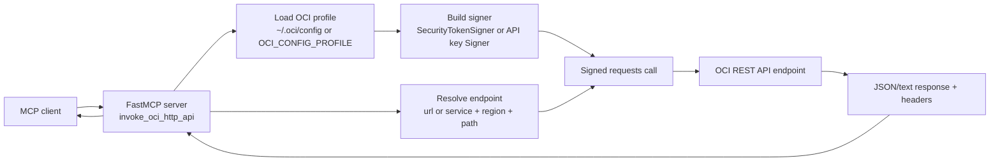

# OCI HTTP MCP Server

## Overview

This server provides a generic signed HTTP interface for Oracle Cloud Infrastructure (OCI).
It invokes OCI REST APIs directly through `requests`, using the local OCI config for signing,
without shelling out to the OCI CLI or routing calls through OCI SDK clients.

## Architecture



The server loads OCI credentials from the local profile, signs the outgoing HTTP request using the OCI SDK signer, sends the request with `requests`, and returns the OCI response back through MCP.

## Running the server

### STDIO transport mode

```sh
uvx oracle.oci-http-mcp-server
```

### HTTP streaming transport mode

```sh
ORACLE_MCP_HOST=<hostname/IP address> ORACLE_MCP_PORT=<port number> uvx oracle.oci-http-mcp-server
```

## Tools

| Tool Name | Description |
| --- | --- |
| invoke_oci_http_api | Make a signed OCI REST request with `requests`. You can provide a full `url`, or combine `service` plus `path` and let the server derive the regional endpoint. |
| get_oci_http_request_guide (Resource) | Returns usage guidance and examples for making direct OCI HTTP requests. |

### invoke_oci_http_api

- `method`: HTTP verb, such as `GET`, `POST`, `PUT`, `PATCH`, `DELETE`, or `HEAD`
- `service`: OCI service name for endpoint discovery, such as `iaas`, `identity`, `monitoring`, or `objectstorage`
- `path`: Service-relative REST path, such as `/20160918/instances`
- `region`: Optional OCI region override. Defaults to the configured profile region
- `endpoint`: Optional explicit service endpoint base URL
- `url`: Optional fully-qualified URL. When provided, endpoint discovery is skipped
- `query`: Optional query-string parameters using the API's native parameter names
- `body`: Optional request body. Dictionaries and lists are sent as JSON automatically
- `headers`: Optional request headers. The server appends its own MCP user agent automatically
- `timeout_seconds`: Optional request timeout. Defaults to `30`
- `verify_ssl`: Optional SSL verification override. When omitted, the server uses `OCI_HTTP_VERIFY_SSL` or defaults to `true`

Example request:

```json
{
  "method": "GET",
  "service": "iaas",
  "path": "/20160918/instances",
  "query": {
    "compartmentId": "ocid1.compartment.oc1..exampleuniqueID"
  }
}
```

Example response shape:

```json
{
  "method": "GET",
  "url": "https://iaas.us-phoenix-1.oraclecloud.com/20160918/instances?compartmentId=...",
  "status_code": 200,
  "ok": true,
  "opc_request_id": "abcd-efgh-....",
  "headers": {
    "content-type": "application/json"
  },
  "data": {
    "items": []
  }
}
```

## Authentication and configuration

This server uses the same OCI config conventions as the OCI CLI and OCI SDK:

- Loads configuration from `~/.oci/config` or the profile named by `OCI_CONFIG_PROFILE`
- Prefers a security token signer when `security_token_file` is configured and available
- Falls back to API key signing otherwise
- Appends an MCP-specific user agent for telemetry and troubleshooting

## Notes

- Query parameters and body fields should use the native OCI REST API names, which are often camelCase
- Pagination is not automatic in this server; if a response includes `opc-next-page`, pass that value back as the `page` query parameter on the next call
- All actions run with the permissions of the configured OCI principal, so least-privilege IAM remains important

## Third-Party APIs

Developers choosing to distribute a binary implementation of this project are responsible for obtaining and providing all required licenses and copyright notices for the third-party code used in order to ensure compliance with their respective open source licenses.

## Disclaimer

Users are responsible for their local environment and credential safety. Different language model selections may yield different results and performance.

## License

Copyright (c) 2026 Oracle and/or its affiliates.

Released under the Universal Permissive License v1.0 as shown at  
<https://oss.oracle.com/licenses/upl/>.
