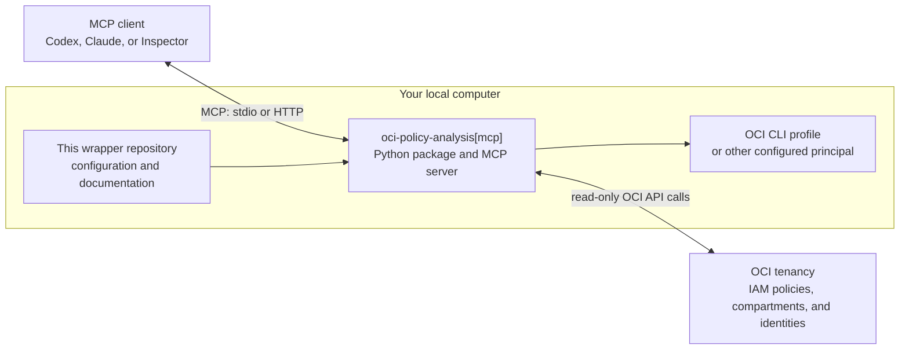

# OCI Identity Policy MCP Server

## Overview

This repository is a thin wrapper around the MCP server from the
`oci-policy-analysis` Python package. It gives MCP clients a focused way to
answer questions about OCI IAM policies, identity domains, users, groups,
dynamic groups, compartments, and cached policy snapshots in your tenancy.

This wrapper is intentionally pip-only. It covers a local Python install, the
OCI CLI `DEFAULT` profile, and a tenancy with a single identity domain or
root-level identity domains. For non-default profiles, caches, client-specific
examples, and troubleshooting, see the [full README](README-FULL.md).

## How the pieces fit



The wrapper supplies packaging and setup guidance; `oci-policy-analysis[mcp]`
provides the server implementation. Your configured OCI principal authorizes
the package to read IAM data from the tenancy.

## Tools

| Tool Name | Description |
| --- | --- |
| `policy_search` | Search OCI IAM policies for one policy question, such as who can manage a resource or which policies mention a compartment. |
| `policy_search_set` | Run a checklist of related policy searches, such as install validation or access review coverage. |
| `policy_history_search` | Compare policy search results across snapshots or caches. |
| `identity_search` | Search OCI users, groups, dynamic groups, compartments, domains, and group memberships. |
| `data_operations` | Check loaded data status, list caches, load a cache, or reload live OCI data. |
| `cross_tenancy_search` | Inspect cross-tenancy aliases and cross-tenancy policy statements. |

Start with `policy_search` for most policy questions. Use `identity_search`
when the user asks who or what an identity is, and `data_operations` when
checking server readiness, cache state, or stale results.

## Quick Start

### 1. Grant Read-Only IAM Access

Create or use an OCI group for the user behind your local OCI CLI `DEFAULT`
profile, then grant it read-only access to IAM policy and identity data:

```text
allow group PolicyAnalysisUsers to {POLICY_READ, COMPARTMENT_INSPECT, DOMAIN_INSPECT, DYNAMIC_GROUP_INSPECT, GROUP_INSPECT, USER_INSPECT, LIMITS_VIEW_INSPECT} in tenancy
```

Add only the user that should run this tool to that group.

### 2. Confirm Your OCI Profile

Make sure your local OCI CLI `DEFAULT` profile can authenticate:

```sh
oci iam region list --profile DEFAULT
```

The quickstart assumes your OCI config lives in the normal location:

```text
~/.oci/config
```

### 3. Install The Python Package

This wrapper targets Python 3.13+.

```sh
python3.13 -m venv .venv
source .venv/bin/activate
python -m pip install --upgrade pip
python -m pip install --upgrade "oci-policy-analysis[mcp]>=6.5.1"
```

Verify the MCP server is installed:

```sh
python -m oci_policy_analysis.mcp_server --help
```

### 4. Run The Local MCP Server

Start the server locally with live OCI data from the `DEFAULT` profile:

```sh
python -m oci_policy_analysis.mcp_server \
  --profile DEFAULT \
  --transport streamable-http \
  --host 127.0.0.1 \
  --port 8765 \
  --log-level INFO
```

The MCP endpoint is:

```text
http://127.0.0.1:8765/mcp
```

The health endpoint is:

```text
http://127.0.0.1:8765/health
```

### 5. Smoke Test

Connect MCP Inspector, Codex, Claude, or another Streamable HTTP-capable MCP
client to:

```text
http://127.0.0.1:8765/mcp
```

Call the `data_operations` tool with:

```json
{
  "operation": "get_status"
}
```

A successful response confirms the server loaded your OCI IAM data and is ready
for policy and identity searches.

## Full Documentation

The [full README](README-FULL.md) covers cache creation, `stdio` clients,
non-default profiles, instance and resource principals, session-token profiles,
Claude Desktop, Codex, runtime arguments, and troubleshooting.

## Third-Party APIs

Developers choosing to distribute a binary implementation of this project are
responsible for obtaining and providing all required licenses and copyright
notices for the third-party code used in order to ensure compliance with their
respective open source licenses.

## Disclaimer

Users are responsible for their local environment and credential safety.
Different language model selections may yield different results and
performance.

## License

Copyright (c) 2025 Oracle and/or its affiliates.

Released under the Universal Permissive License v1.0 as shown at
<https://oss.oracle.com/licenses/upl/>.
