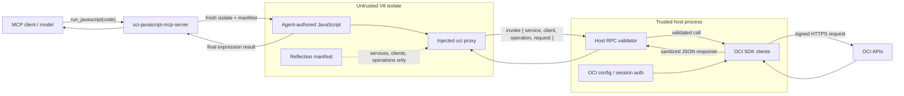
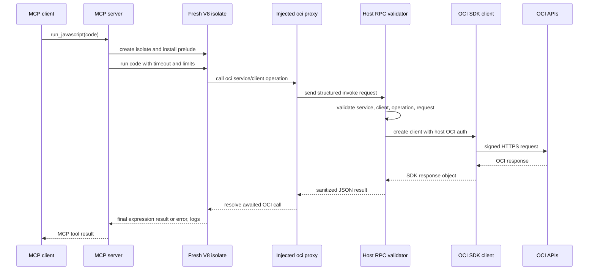

# OCI JavaScript MCP Server

`oci-javascript-mcp-server` lets an MCP client run agent-authored JavaScript that calls OCI through a trusted host bridge.

Sandboxed JavaScript runs inside a V8 isolate with no OCI credentials, no inherited environment, no Node built-ins, no filesystem access, and no network API. OCI calls are made through a narrow host RPC binding to the trusted server process, which loads the Oracle `oci-sdk` package and host OCI config.

## Architecture



Conceptually, the model writes ordinary JavaScript, but that JavaScript runs in
a locked-down V8 isolate that cannot see files, environment variables, network
APIs, credentials, or the real OCI SDK. The key breakthrough is the narrow RPC
bridge: sandbox code can only send structured OCI operation requests to the
trusted host process, and the host validates, signs, executes, sanitizes, and
returns JSON results without ever handing credentials into the sandbox.

## Request Flow



## Install

For local development from this package directory:

```bash
npm install
npm start
```

After the package is published, install it as a command:

```bash
npm install -g oci-javascript-mcp-server
oci-javascript-mcp-server
```

This implementation requires Node 26 or newer. The server implementation uses Node's built-in TypeScript stripping, and `isolated-vm` requires Node to run with `--no-node-snapshot`. Installing `isolated-vm` uses a native package install step; environments that require explicit npm script approval must allow that install script or provide the native build toolchain it needs.

## Invoke

The server speaks MCP over stdio using the official MCP TypeScript SDK. For
manual local development, run it from this directory:

```bash
node --no-node-snapshot --experimental-strip-types src/server.ts
```

For an MCP client, prefer invoking `node` directly instead of `npm start` so
npm's lifecycle output does not interfere with stdio JSON-RPC messages.

Local checkout:

```json
{
  "mcpServers": {
    "oci-javascript-mcp-server": {
      "type": "stdio",
      "command": "node",
      "args": [
        "--no-node-snapshot",
        "--experimental-strip-types",
        "<absolute path to this repo>/src/oci-javascript-mcp-server/src/server.ts"
      ],
      "env": {
        "OCI_CONFIG_PROFILE": "<profile_name>"
      }
    }
  }
}
```

Globally installed package:

```json
{
  "mcpServers": {
    "oci-javascript-mcp-server": {
      "type": "stdio",
      "command": "oci-javascript-mcp-server",
      "env": {
        "OCI_CONFIG_PROFILE": "<profile_name>"
      }
    }
  }
}
```

The server reads OCI credentials from the host process using the standard OCI
config file. Set `OCI_CONFIG_FILE` or `OCI_CONFIG_PROFILE` in the client
environment when you need a non-default config path or profile.

## Tools

### `run_javascript`

Primary tool for OCI tasks. The agent writes one complete JavaScript script and
uses the injected `oci` binding. The script's final expression is returned as
structured `result`. `console.log` is available for incidental debugging. Scripts that only log or
perform side effects can end with a statement whose value is `undefined`; their
structured `result` will be `null`.

Uncaught JavaScript or OCI errors are returned as structured `error` values.
`stdout` and `stderr` are reserved for logs written by the script.

Treat this like normal code execution: write and run straightforward JavaScript
first. Use `discover_oci` only after an SDK shape error or when the service,
client, operation, or request/model shape is genuinely unclear.

```js
const config = await oci.config();
const response = await oci.identity.IdentityClient.listRegionSubscriptions({
  tenancyId: config.tenancyId,
  limit: 50
});

response.items.map(region => region.regionName);
```

Client construction works too:

```js
const compute = new oci.core.ComputeClient();
const instances = await compute.listInstances({
  compartmentId,
  limit: 50
});
instances.items.map(instance => ({
  name: instance.displayName,
  shape: instance.shape,
  state: instance.lifecycleState
}));
```

For multi-page list operations, use the OCI SDK request and response fields
directly: pass `limit`, then pass `response.opcNextPage` as `page` on the next
request.

```js
const compute = new oci.core.ComputeClient();
const instances = [];
let page;

do {
  const request = { compartmentId, limit: 100, ...(page ? { page } : {}) };
  const response = await compute.listInstances(request);
  instances.push(...response.items);
  page = response.opcNextPage;
} while (page);

instances.map(instance => instance.displayName);
```

Pass `region` as a client initialization option when a script needs to work
across multiple OCI regions. Region selection is per client instance and does
not mutate the configured default region:

```js
const iadCompute = new oci.core.ComputeClient({ region: "us-ashburn-1" });
const phxCompute = new oci.core.ComputeClient({ region: "us-phoenix-1" });

const [iadInstances, phxInstances] = await Promise.all([
  iadCompute.listInstances({ compartmentId, limit: 50 }),
  phxCompute.listInstances({ compartmentId, limit: 50 })
]);

({
  "us-ashburn-1": iadInstances.items.length,
  "us-phoenix-1": phxInstances.items.length
});
```

The injected OCI surface is reflective. Normal JavaScript introspection works
for the shallow SDK shape:

```js
Object.keys(oci);                         // services plus config
Object.keys(oci.core);                    // clients
Object.keys(oci.core.ComputeClient());    // operations
"listInstances" in oci.core.ComputeClient();
```

Reflection is generated from the host's installed `oci-sdk` package and passed
to the sandbox as plain metadata. The real SDK, credentials, signer, and network
stack stay in the trusted host process. Only OCI API operations with SDK request
types are callable through the bridge; local SDK helper methods are not exposed.

### `discover_oci`

Fallback SDK introspection. Do not call this by default. Use it after a JavaScript attempt fails or when the agent genuinely needs to inspect available services, client names, operation names, or request/model fields.

## Security Model

The server process is trusted and owns OCI credentials. The sandboxed V8 isolate is untrusted and receives only `console` and the generated OCI binding. It cannot import Node modules and has no direct network or filesystem capability.

This is still a single-process sandbox. For production hardening against V8 or native-addon failures, run the server with an outer container or microVM boundary and a conservative network policy.
