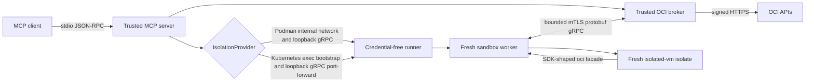
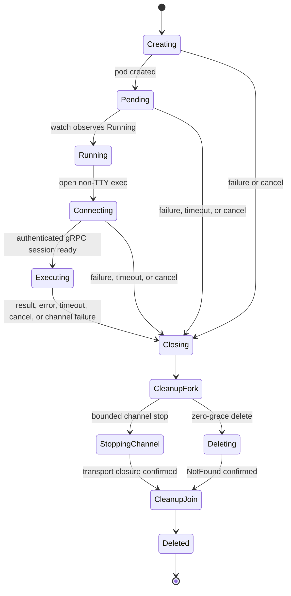

# OCI JavaScript MCP Server Architecture and Isolation Design

| Field | Value |
| --- | --- |
| Status | Draft for technical and security review |
| Last updated | 2026-10-01 |
| Scope | MCP server, OCI broker, isolation-provider contract, Kubernetes execution engine, and Kata profile layer |
| Intended audience | MCP maintainers, OCI security reviewers, Kubernetes platform operators, and Kata runtime owners |
| Decision owner | TBD |
| Reviewers | TBD |
| Target release | TBD; this document does not grant production approval |

## 1. Executive summary

The OCI JavaScript MCP server lets an MCP client submit a complete JavaScript
program through `run_javascript`. The program receives an SDK-shaped `oci`
facade, while OCI credentials, the real OCI SDK, request validation, deadlines,
budgets, and OCI HTTPS calls remain in the trusted host process.

Each invocation runs in a fresh, credential-free runner behind one selected
`IsolationProvider`. Podman is the compatibility default. The Kubernetes
provider implements the same runner protocol through one fresh pod per call and
requires an exact profile:

- `local-development` for an explicit workstation kubeconfig and the cluster's
  standard runtime;
- `in-cluster` for service-account credentials and the cluster's standard
  runtime; or
- `kata-in-cluster` for the in-cluster topology plus an exact, preflighted Kata
  `RuntimeClass` and handler.

The Kubernetes engine owns connection, pod lifecycle, protocol transport,
cleanup, and reconciliation. Runtime profiles may add reviewed constraints but
cannot weaken the base pod. Kata is therefore a narrow additive policy layer,
not a separate execution engine.

This design treats untrusted JavaScript, the runner, and every runner protocol
message as hostile. It does not treat a standard container, a `RuntimeClass`
object, or successful pod execution as proof of a VM-grade boundary. The Kata
profile remains a proof of concept until real-node evidence, effective network
and resource evidence, image provenance, operational ownership, and a current
security review are complete.

## 2. Document authority and current status

This document consolidates the current worktree into one formal system design.
When sources disagree, authority is applied in this order:

1. Current implementation and tests under `src/` and `test/`.
2. Current OpenSpec capability specifications; archived proposals and designs
   supply historical context and may describe an earlier transport.
3. The deployment guides and versioned example manifests.
4. The earlier internal Confluence design, which remains historical context.

The internal design describes an earlier `process` provider and future gVisor
or Firecracker options. Those descriptions are not the current provider model.
This draft retains the earlier trust-boundary intent but reflects the implemented
Podman and Kubernetes architecture.

### 2.1 Maturity statement

| Area | Worktree status | Production posture |
| --- | --- | --- |
| MCP stdio tools and result contract | Implemented and tested | Local/trusted-caller use only |
| Host OCI broker and SDK-shaped facade | Implemented and tested | Uses the configured host principal; independent per-caller OCI authorization is unresolved |
| Hostile protobuf gRPC v4 session | Implemented and tested | Requires review with the selected runtime and deployment topology |
| Podman provider | Implemented; unset default | Shared-kernel compatibility boundary, not VM-grade isolation |
| Kubernetes `local-development` | Implemented; opt-in | Development-only container isolation |
| Kubernetes `in-cluster` | Implemented; opt-in | Standard shared-kernel container isolation |
| Kubernetes `kata-in-cluster` | Code-complete POC with fake/static evidence | Not production-admitted; real Kata evidence and security review are pending |
| HTTP or multi-user transport | Not implemented | Out of scope until caller authentication and authorization are designed |

## 3. Problem statement

Agents need a compact way to inspect and operate OCI with ordinary JavaScript
instead of requiring one MCP tool per SDK operation. Directly giving
model-authored code the OCI SDK or host credentials would make any sandbox
escape, dependency bug, or prompt-driven misuse equivalent to credential
compromise.

The design must provide JavaScript ergonomics while preserving three distinct
control planes:

- the MCP server validates tool input and limits tool-call concurrency;
- the trusted OCI broker owns credentials, SDK clients, validation, deadlines,
  and response sanitization; and
- the isolation provider owns creation and confirmed destruction of the
  per-execution runner boundary.

The Kubernetes design must also separate generic pod lifecycle from the
runtime-specific assurance claim. Local and standard in-cluster profiles are
useful for lifecycle and deployment validation, but only the Kata profile asks
Kubernetes to use a VM-backed runtime, and that request still requires external
evidence.

## 4. Goals and non-goals

### 4.1 Goals

- Provide one `run_javascript` contract across Podman and all Kubernetes
  profiles.
- Keep OCI credentials, signers, SDK clients, Kubernetes credentials, and raw
  provider errors outside the execution runner.
- Preserve an SDK-shaped JavaScript interface without treating the facade as an
  authorization boundary.
- Create a fresh process/container/pod and V8 isolate for each call.
- Enforce one absolute execution deadline across provider startup, runner work,
  OCI RPC, and result delivery, followed by one separately bounded cleanup tail
  shared concurrently by provider termination and pending-RPC draining.
- Make provider, credential source, runtime policy, image policy, and assurance
  posture explicit and fail closed.
- Share one hardened Kubernetes pod shape and lifecycle implementation.
- Allow Kata to add only an exact `RuntimeClass`, handler preflight, admission
  checks, and assurance evidence fields.
- Confirm cleanup before reporting a successful or timed-out execution.
- Retain enough bounded diagnostics and labels to investigate failures and
  reconcile expired pods without exposing guest or provider-sensitive data.

### 4.2 Non-goals

- Providing a general Node.js runtime, shell, filesystem, module loader, or
  network API to guest code.
- Treating Podman, the standard Kubernetes runtime, or `isolated-vm` as a
  separate-kernel or hardware-virtualized security boundary.
- Automatically discovering credentials or runtimes, selecting a stronger
  sounding profile, or falling back after provider failure.
- Allowing operators or callers to supply arbitrary pod fragments, commands,
  environment variables, volumes, security contexts, or runtime classes.
- Proving Kata, CNI, CRI, node, hypervisor, guest-kernel, PID, overhead, or image
  controls using fake APIs, object existence, or provider self-description.
- Defining HTTP transport, caller authentication, per-user OCI delegation, or a
  complete OCI operation/compartment policy in this iteration.
- Defining throughput or high-concurrency targets.
- Supporting OKE virtual nodes for the Kata profile.

## 5. Requirements

Normative terms such as **MUST**, **MUST NOT**, and **SHOULD** describe the
intended design. A requirement is not evidence that a deployment satisfies it.

### 5.1 Functional requirements

| ID | Requirement |
| --- | --- |
| F-1 | `run_javascript` MUST accept one complete script and return `result`, `error`, `stdout`, `stderr`, `exit_code`, and `timed_out`. |
| F-2 | `discover_oci` MUST remain host-side and read-only from the MCP contract perspective. |
| F-3 | The `oci` facade MUST support the reviewed SDK-like service, client, operation, request, response, pagination-field, and per-client region shapes. |
| F-4 | One provider MUST be selected at trusted startup. Kubernetes MUST additionally select one exact profile. |
| F-5 | Provider or profile construction failure MUST stop startup and MUST NOT trigger fallback or guest-code replay. |
| F-6 | Each `run_javascript` invocation MUST receive a fresh runner boundary, worker, and V8 isolate. |
| F-7 | Every provider MUST implement the same `IsolationExecution` result and idempotent termination contract. |

### 5.2 Security requirements

| ID | Requirement |
| --- | --- |
| S-1 | Guest code and the runner MUST NOT receive OCI credentials, OCI signers, the real OCI SDK, Kubernetes credentials, host environment, host filesystem mounts, runtime sockets, or a general network API. |
| S-2 | Every runner message and OCI RPC request MUST be treated as attacker-controlled and validated independently of the facade. |
| S-3 | The host MUST enforce message, structure, request, response, output, call-count, concurrent-call, and absolute-deadline limits. |
| S-4 | The provider MUST close its channel and confirm destruction of its execution resource before cleanup succeeds. |
| S-5 | Kubernetes profiles MUST use a complete host-constructed pod; no arbitrary mutation hook or operator-supplied pod fragment is permitted. |
| S-6 | In-cluster execution pods MUST use a zero-authority service account with token automount disabled. |
| S-7 | In-cluster host and execution namespaces MUST differ, and cross-namespace RBAC MUST grant only the required execution lifecycle operations. |
| S-8 | In-cluster images MUST be immutable digest references. A local tag is allowed only by the development profile with explicit opt-in and `imagePullPolicy: Never`. |
| S-9 | Kata runtime selection MUST be additive and MUST NOT change credentials, command, environment, volumes, resources, base security context, deadlines, protocol, or cleanup. |
| S-10 | Provider and Kubernetes errors MUST be sanitized before entering MCP result fields. |
| S-11 | Finalization MUST disable new bridge work and abort the run before provider termination and pending-RPC draining begin concurrently against one host-clamped cleanup deadline. |
| S-12 | Trusted OCI clients MUST use the SDK no-retry policy, a disabled client circuit breaker, and abort-aware HTTP options; guest input MUST NOT override those controls. |

### 5.3 Operational requirements

| ID | Requirement |
| --- | --- |
| O-1 | Startup MUST preflight the selected profile before connecting MCP stdio. |
| O-2 | Managed Kubernetes pods MUST carry stable manager, provider, profile, correlation, and expiry metadata. |
| O-3 | Normal cleanup and reconciliation MUST be idempotent and MUST confirm Kubernetes `NotFound`. |
| O-4 | In-cluster deployments MUST include an independent cleanup-only reconciler with no create or `pods/exec` authority. |
| O-5 | Diagnostics MUST be bounded and allowlisted and MUST exclude code, guest output, protocol payloads, raw provider errors, credentials, endpoints, and resource details. |
| O-6 | Changes to runtime, node image, CRI mapping, CNI, admission, identity, image digest, or reconciler deployment MUST trigger profile revalidation. |

## 6. System context and trust boundaries

The diagram is logical: the broker traffic is mediated by the server and
provider-neutral gRPC session. The runner cannot connect directly to OCI.

### 6.1 Trust classification

| Component | Trust | Responsibility |
| --- | --- | --- |
| MCP client | Trusted only according to deployment mode | Supplies tool arguments; must not be assumed authenticated in a future shared transport |
| MCP server | Trusted | Registers tools, validates input, selects the provider at startup, and limits active/queued calls |
| OCI broker | Trusted | Owns SDK/authentication, validates OCI RPC, enforces budgets, sanitizes responses and errors |
| Provider factory/configuration | Trusted | Parses closed provider/profile bundles and creates exactly one provider |
| Kubernetes API adapter | Trusted | Loads one explicit credential source and translates typed lifecycle operations |
| Runner, worker, isolate, facade | Untrusted | Executes attacker-controlled code and emits hostile protocol messages |
| Kubernetes control plane/node/runtime | External trusted computing base | Enforces RBAC, admission, scheduling, pod security, CNI, CRI, and the selected runtime |
| OCI services and IAM | External authority | Authenticate the host principal and authorize final OCI API calls |

### 6.2 Assets

- OCI credentials, signers, SDK clients, and host identity.
- Kubernetes kubeconfig or in-cluster service-account credentials.
- OCI data returned through successful API operations.
- Trusted host availability and resource budgets.
- Isolation integrity between concurrent or sequential executions.
- Audit correlation without disclosure of guest or credential material.

### 6.3 Adversaries and compromise assumptions

- Model-authored JavaScript is arbitrary and potentially malicious.
- The SDK-shaped facade can be bypassed after an isolate compromise.
- The runner may send raw, malformed, reordered, oversized, or concurrent
  protocol messages.
- A shared-kernel container escape may compromise its node or host.
- A Kata guest compromise may drive the execution's existing channel; a Kata,
  hypervisor, runtime, or node escape crosses the intended VM boundary.
- Kubernetes and OCI operators may misconfigure identities, policies, runtimes,
  networking, images, or evidence.

The broker and lifecycle controls must remain safe through runner compromise.
They are not expected to remain safe after trusted-host compromise.

## 7. MCP server and OCI broker design

The server exposes `run_javascript` and `discover_oci` over stdio. It constructs
the provider and OCI host before connecting transport, so invalid Kubernetes
configuration or preflight failure prevents request acceptance.

`run_javascript` validates the code-size and 1–120 second timeout contract,
applies bounded active and queued call limits, lazily builds OCI reflection
metadata, and delegates one execution to the selected provider. The host then:

1. establishes an absolute deadline and abort signal;
2. bounds host RPC request size, call count, and concurrent calls;
3. validates the provider execution handle and result schema;
4. disables new bridge calls and aborts the run before finalization;
5. starts provider termination and a rejection-observing snapshot drain of
   pending OCI calls concurrently against one host-clamped cleanup deadline; and
6. returns `isolation provider cleanup failed` if provider teardown fails;
7. otherwise returns `OCI cleanup did not complete` if pending OCI work does not
   settle before the cleanup deadline, overriding any earlier outcome; and
8. only for an otherwise successful run whose drain completes, returns
   `JavaScript completed with unawaited OCI calls` when bridge work was still
   pending at finalization.

The OCI broker validates the binding, namespace, operation, service, client,
client options, and request shape before constructing a real SDK client. It
keeps credentials, signers, retry implementation, HTTP transport, and raw SDK
objects on the host and returns bounded JSON-compatible data.

Each trusted SDK client receives `NoRetryConfigurationDetails`, a client-level
disabled circuit breaker, and the execution abort signal in its HTTP options.
This prevents an aborted request from entering non-abortable retry backoff or
the SDK's default breaker. Retry and circuit-breaker options remain outside the
guest client-option allowlist. A late SDK promise stays rejection-observed but
cannot restore bridge acceptance or alter a finalized MCP result.

### 7.1 Current authorization limitation

The current stdio design uses the host's configured OCI identity. OCI IAM is the
final authorization boundary, and the broker validates SDK shape and budgets,
but it does not yet implement a complete per-caller policy for service,
operation effect, tenancy, compartment, resource, or response sensitivity.
Consequently:

- the current design assumes a trusted local caller with access equivalent to
  the configured host principal;
- a shared or remote deployment is not admitted by this document; and
- HTTP work must define caller authentication, delegated identity or explicit
  host-principal use, authorization, approval, rate-limit, and audit semantics
  before implementation.

## 8. Provider-neutral worker protocol

`IsolationProvider.run()` returns an `IsolationExecution` containing a result
promise, an idempotent `terminate(cleanupDeadlineMs)` operation, and an optional
host-bounded termination allowance. Podman and Kubernetes use the same
`oracle.oci.mcp.runner.v4.Runner.Session` bidirectional protobuf gRPC service
from `proto/runner.proto`; the earlier length-prefixed JSON transport is retired.

Each execution receives fresh mutually authenticated TLS identities. The
bootstrap gives the runner its server key/certificate and the host's public
certificate; the host's private key stays in the trusted host. Podman sends it
over container stdin, then reaches gRPC through an internal network and host
loopback port. Kubernetes uses non-TTY exec for bootstrap/lifecycle and one
loopback port-forward for gRPC. No replay, resumption, or fallback is provided.

The current transport enforces:

- one authenticated runner session and one execute message;
- exactly one known protobuf body per decoded message, required scalar presence,
  and consistent terminal result status;
- combined gRPC message limits and separately bounded source, logs, OCI request,
  JSON result/error, and reflection payloads;
- bounded UTF-16LE source/log bytes that preserve all JavaScript code units,
  including unpaired surrogates; dynamic OCI data remains bounded UTF-8 JSON
  with depth, string, array, key, node, and dangerous-key validation;
- nonzero protobuf `uint32` RPC IDs and host OCI call-count/concurrency limits;
- native gRPC wait-for-ready, an absolute session deadline, cancellation, and
  final status: a valid result is accepted only with gRPC `OK`;
- suppression of later runner messages after a decoded terminal result,
  host-stream closure, and failure when an RPC reply write reports backpressure;
  and
- sanitized public protocol/provider errors and confirmed provider teardown.

The host does not track used RPC IDs to enforce uniqueness against a compromised
runner. No general cumulative ingress/egress accounting or semantic classification
of successful OCI output is implemented. These remain residual risks and review
requirements, rather than controls established by protobuf or mTLS. Native gRPC
lifecycle signals replace the earlier health, log, cancel, and protocol-error
messages; stdout/stderr travel in the final result. Host and runner must be
updated together because the v4 endpoint is incompatible with earlier versions.

## 9. Isolation provider design

### 9.1 Selection

`OCI_JAVASCRIPT_ISOLATION_PROVIDER` accepts only `podman` or `kubernetes`.
Omission selects Podman for compatibility. Selecting Kubernetes requires one
exact `OCI_JAVASCRIPT_KUBERNETES_PROFILE`. Profile-specific variables are
rejected when they do not belong to the selected profile.

Selection is trusted startup configuration, never MCP input. Construction and
preflight are authoritative: the server does not discover an available backend,
retry guest code elsewhere, or silently weaken isolation.

### 9.2 Podman provider

The Podman provider launches a uniquely named container through a direct CLI
spawn with fixed arguments. It creates a fresh internal network with DNS
disabled and publishes only the runner gRPC port to host loopback. It disables
capabilities, privilege escalation, writable root, image pulling, and Podman
logging; uses a non-root UID/GID; and sets CPU, memory, PID, file-descriptor, and `/tmp` limits.

The provider is the compatibility default, but it shares the host kernel and is
not equivalent to Kata or another independently reviewed VM boundary. Cleanup
kills the process tree and force-removes the named container and internal
network within the host's termination clamp.

## 10. Kubernetes execution engine

The Kubernetes provider is one execution engine composed from:

- strict profile-bound configuration;
- an explicit kubeconfig or in-cluster connection factory;
- a typed Kubernetes API adapter;
- a complete hardened pod builder;
- a monotonic standard or Kata runtime policy;
- startup preflight and assurance description;
- a create/watch/exec/port-forward/delete lifecycle;
- provider-neutral mTLS protobuf gRPC execution; and
- host and independent expiry reconciliation.

### 10.1 Closed profile bundles

| Profile | Trusted host | Credentials | Runtime policy | Image policy | Assurance label |
| --- | --- | --- | --- | --- | --- |
| `local-development` | Workstation | Required absolute kubeconfig path and exact context | Standard; no `runtimeClassName` | Digest, or explicitly allowed safe local tag with `Never` | `development-only-container` |
| `in-cluster` | Trusted host pod | In-cluster service account only | Standard; no `runtimeClassName` | Lowercase SHA-256 digest required | `in-cluster-container` |
| `kata-in-cluster` | Trusted host pod | In-cluster service account only | Exact Kata `RuntimeClass` and handler | Lowercase SHA-256 digest required | `kata-poc` |

The local client loads only the configured file and context. In-cluster clients
call only `loadFromCluster()`. There is no default-path search or credential
fallback. Kubernetes credentials remain in the trusted host and are never
mounted into the runner.

### 10.2 Startup preflight

Before MCP stdio connects, the selected profile:

1. reads the execution namespace;
2. verifies required namespace, pod, watch, delete, `pods/exec`, and
   `pods/portforward` authority
   through `SelfSubjectAccessReview`, naming the configured Namespace exactly
   while leaving dynamic pod operations namespace-scoped;
3. for Kata, reads the exact `RuntimeClass`, compares its handler, and verifies
   exact named RuntimeClass read authority;
4. server-side dry-runs the exact conforming execution pod;
5. dry-runs one stable identified variant for every reviewed metadata/profile,
   image/pull-policy, identity/token/service-link, restart/host namespace,
   command/environment, container cardinality, root/security-context,
   capability/seccomp/filesystem, resource/deadline, port/device/probe/hook,
   volume, and `/tmp` invariant;
6. for Kata, also verifies rejection of a wrong runtime class;
7. reconciles expired pods for the exact namespace/profile; and
8. records only `reviewed-variants-rejected` (or local `unverified`), marks the
   exact deployed policy revision unverified, and starts periodic reconciliation.

Unsafe-variant acceptance fails in-cluster preflight. Local development may
continue with admission marked unverified because its purpose is lifecycle
testing, not production assurance.

### 10.3 Base execution pod

The host constructs the complete pod. The base shape includes:

- a unique name and exact manager/provider/profile labels;
- correlation and trusted expiry annotations, with in-cluster host identity
  annotations;
- `Never` restart and an active deadline derived from the tool deadline;
- a zero-authority runner service account with token automount and service links
  disabled;
- no host network, PID, or IPC namespace and no owner reference;
- fixed non-root UID/GID 65532, `RuntimeDefault` seccomp, all capabilities
  dropped, privilege escalation disabled, and a read-only root filesystem;
- equal CPU, memory, and ephemeral-storage requests and limits; and
- one bounded, memory-backed `/tmp` volume.

The container first runs a fixed silent Node wait command. The host opens a
non-TTY exec stream only after the pod is Running and then starts the fixed
sandbox worker command. It sends one execution-scoped mTLS bootstrap over
exec stdin, waits for `READY\n`, then opens one host-loopback port-forward to
runner port 50051. The session uses native gRPC readiness and a deadline; no
Service or declared container port is needed. No caller-configurable command,
environment, or pod fragment is accepted.

### 10.4 Execution state machine

The 1–120 second tool deadline covers create, scheduling, image availability,
exec bootstrap, port-forward setup, gRPC readiness, worker execution, OCI
RPC, and result delivery. Finalization then receives one separate configured
allowance, capped by the host at 60 seconds.
Channel close and confirmed pod deletion run concurrently with bounded pending-
RPC draining against that same deadline, rather than consuming serial tails.
Deletion is zero-grace and must be confirmed. gRPC termination, runner
acquisition/stop, tunnel acquisition/stop, and delete/NotFound confirmation
start as independent concurrent tasks against the caller-supplied cleanup
deadline. A stalled acquisition or transport stop cannot prevent deletion from
being attempted. Any unconfirmed transport closure or deletion overrides the
earlier outcome with the cleanup-failure result. Late transport handles receive
the original cleanup deadline; late pod creation triggers compensating deletion.
Startup observes runner/tunnel failure immediately and fails if either closes
before final gRPC status; completed gRPC status remains authoritative.

For Kubernetes, confirmed deletion means the pod object is absent from the API.
It does not establish that the process has stopped on its node: zero-grace
deletion does not wait for kubelet termination confirmation. The pod active
deadline and expiry reconciler provide additional cleanup safeguards, subject to
kubelet and control-plane availability. An unreachable node can continue running
a process after API-object removal; these profiles do not prove node-level
termination during an outage. See Kubernetes' [forced pod termination](https://kubernetes.io/docs/concepts/workloads/pods/pod-lifecycle/#forced-pod-termination)
semantics.

### 10.5 Reconciliation

Each host reconciles at startup and periodically. It adopts only pods in the
configured namespace with the exact manager, provider, and profile labels and a
well-formed expired timestamp. It preserves unrelated, malformed, other-profile,
and non-expired pods.

Listing receives a five-second bound that aborts its API request on timeout.
The standalone reconciler also propagates shutdown cancellation into listing and
candidate requests. A stalled listing fails that cycle and permits later
periodic cycles to run.
Each candidate receives a separate five-second delete-and-confirmation bound. A failure
increments the aggregate failure count and processing continues with later
candidates. Startup consumes the complete summary before failing; periodic host
and cleanup-only reconciliation emit one sanitized aggregate success/failure
count and continue future intervals. Diagnostics never include candidate names
or raw API errors.

In-cluster profiles also deploy an independent cleanup-only reconciler outside
the execution namespace. Its RBAC permits get/list/watch/delete but not create
or `pods/exec`, allowing orphan cleanup when every trusted host replica is down.
Local development relies on host reconciliation.

## 11. Kata profile layer

Kata is a typed additive runtime policy over the generic Kubernetes engine. Its
code-level authority is deliberately limited to:

- requiring `kata-in-cluster` configuration;
- adding the exact `runtimeClassName` to the otherwise identical base pod;
- reading the named cluster-scoped `RuntimeClass` and comparing the exact
  handler;
- adding RuntimeClass RBAC and a wrong-runtime admission probe; and
- reporting Kata-specific requested and unverified evidence.

Kubernetes `RuntimeClass` selects a CRI handler, while the node's CRI
configuration defines what that handler actually runs. The provider therefore
does not inspect or mutate containerd, CRI-O, node files, runtime sockets,
hypervisor configuration, guest images, or Kata installation state.

Kata represents a Kubernetes pod sandbox as a lightweight VM, but the existence
of a `RuntimeClass`, matching handler text, accepted pod, or completed execution
does not establish that the reviewed guest kernel and hypervisor were used.
Production admission requires independent evidence bound to the exact runtime,
node pool, CRI configuration, Kata release and configuration, guest assets,
image digests, and network/resource controls.

### 11.1 Required Kata evidence

At minimum, a candidate deployment must capture and review:

- Kubernetes version, node image, architecture/shape, kernel, and virtualization
  support;
- pinned Kata release, runtime implementation, hypervisor, configuration, guest
  kernel, guest image/initrd, and artifact digests;
- RuntimeClass name, handler, scheduling constraints, tolerations, and overhead;
- rendered CRI-O or containerd handler mapping on every admitted node;
- proof from the execution context that the observed kernel is the expected
  Kata guest kernel and not the node kernel;
- absence of OCI/Kubernetes credentials, host mounts, devices, runtime sockets,
  and unexpected writable storage in the guest;
- effective CPU, memory, PID, descriptor, storage, timeout, cancellation, and
  deletion behavior;
- effective CNI denial for metadata, node, control-plane, service, private,
  link-local, and public egress as applicable to the deployment;
- host and independent reconciler behavior through outage, restart, orphan,
  and node-replacement scenarios; and
- current security review approval with named operational ownership and
  revalidation triggers.

## 12. Kubernetes control-plane and deployment design

The versioned manifests use separate trusted-host and execution namespaces,
restricted Pod Security labels, distinct host/runner/reconciler service
accounts, cross-namespace least-privilege RBAC, quota and limits, default-deny
NetworkPolicies, admission policy, and an independent reconciler.

These resources are necessary but not sufficient evidence:

- A pod-level `automountServiceAccountToken: false` prevents the default API
  credential injection and is enforced again by admission.
- The Restricted Pod Security Standard aligns with the base pod's non-root,
  no-privilege-escalation, seccomp, and capability settings.
- ValidatingAdmissionPolicy provides declarative CEL-based validation of the
  complete pod shape.
- NetworkPolicy has effect only when the cluster network plugin implements it;
  object existence is not enforcement proof.
- RuntimeClass name and handler validation do not prove the node's effective CRI
  mapping or resulting guest boundary.

## 13. Failure handling and public contract

| Condition | Public behavior | Trusted diagnostic behavior |
| --- | --- | --- |
| Script or sanitized OCI error | Structured `error`, nonzero exit, captured bounded logs | No raw OCI credential/transport detail |
| Absolute deadline | `sandbox run deadline exceeded`, `timed_out: true`, exit `-1` | Allowlisted phase/reason and bounded duration |
| Provider/API/scheduling/exec/channel failure | `isolation provider failed` | Provider/profile, phase, allowlisted reason, correlation ID |
| Hostile or invalid protocol | Sanitized provider/protocol failure | No frame or guest payload logging |
| Pending OCI drain expires after successful provider cleanup | `OCI cleanup did not complete`, overriding the prior outcome | Late promises retain rejection observers |
| Successful script with unawaited OCI work and completed drain | `JavaScript completed with unawaited OCI calls`, non-timeout failure | In-flight work is aborted and drained within the shared cleanup tail |
| Unconfirmed resource deletion | `isolation provider cleanup failed`, overriding prior outcome | Cleanup phase/reason only |
| Startup configuration/RBAC/admission/runtime failure | Server does not connect MCP stdio | Sanitized preflight reason; operator investigates trusted control plane |

Timeout and cancellation remain authoritative during provider startup and OCI
RPC. Finalization disables new calls, aborts in-flight work, and starts provider
termination plus a rejection-observing pending-RPC snapshot drain concurrently.
Both share one cleanup-tail deadline. Failed or unconfirmed provider cleanup
wins with `isolation provider cleanup failed`. Otherwise drain expiry returns
`OCI cleanup did not complete`, including after a timeout or script failure.
Only if the drain completes and the earlier result was successful does pending
work at finalization become the unawaited-call error.

## 14. Observability and assurance reporting

Kubernetes diagnostics are JSON lines on trusted stderr with only provider,
exact profile, random correlation ID, allowlisted phase/outcome/reason, and a
bounded duration. They exclude pod name, code, guest output, OCI request or
response, protocol frames, raw Kubernetes errors, endpoints, and credentials.

The provider descriptor records configured posture rather than inferred
security. It includes credential mode, runtime policy, assurance label, image
policy, namespace separation, admission outcome, nested `isolated-vm`, and
external-evidence flags. Current image provenance, CRI mapping, node runtime,
CNI isolation, PID enforcement, RuntimeClass overhead, and Kata guest kernel
remain explicitly unverified. Admission is described only as
`reviewed-variants-rejected` or `unverified`, and the exact deployed admission
policy revision remains explicitly unverified.

Before production use, the platform owner must define where descriptors and
diagnostics are emitted, retained, access-controlled, alerted, and correlated
with MCP and OCI audit records without exposing sensitive guest data.

## 15. Capacity and availability

The server defaults to four active tool calls and 64 queued calls. A Kubernetes
invocation creates one pod and exec stream, so cluster API rate limits, image
availability, scheduling latency, Kata VM startup, resource quota, and cleanup
latency bound effective capacity.

The current POC demonstrates correctness for a small fixed concurrency set. It
does not establish throughput, latency, saturation, autoscaling, noisy-neighbor,
or cost targets. Production sizing requires measured provider-specific startup
and teardown distributions plus failure and API-outage behavior.

## 16. Validation strategy and acceptance gates

### 16.1 Deterministic validation

- Unit tests for configuration parsing, provider selection, pod construction,
  runtime-policy monotonicity, descriptor contents, diagnostics, and
  reconciliation adoption rules.
- Hostile protocol tests for protobuf envelopes, bounded UTF-16LE text and
  UTF-8 JSON, structural limits, dangerous keys, message sequencing, direct raw
  RPC, oversized data, final-status gating, and concurrent call floods.
- Fake Kubernetes API and exec tests for success, scheduling/image/API/channel
  failure, timeout, cancellation races, permanently pending OCI work, deletion
  confirmation, reconciliation, and multiple isolated executions.
- MCP stdio integration tests proving identical result fields and sanitization
  across Podman and Kubernetes profiles, including deadline plus one-tail timing.
- Static manifest tests for service-account separation, RBAC, admission, pod
  shape, NetworkPolicy, RuntimeClass, and reconciler authority.
- Type checking, at least 90% coverage for statements, branches, functions, and
  lines, and package-content verification. Strict OpenSpec validation applies
  to the source-checkout specifications when that tooling is available.

### 16.2 Real-environment validation

- The opt-in local-cluster harness validates the actual create/watch/exec/delete
  lifecycle for `local-development`; it is not Kata evidence.
- A standard in-cluster environment must validate actual service-account RBAC,
  namespace separation, server-side admission, independent reconciliation,
  quota, and CNI enforcement.
- A Kata canary must satisfy every item in section 11.1 and the current security
  review rubric before any production-admission decision.

### 16.3 Release gates

The implementation may be described as a functionally tested POC when normal CI,
manifest checks, package checks, and applicable OpenSpec validation pass. This
requires actual clean-install and final-image evidence for the installation
policy; existing-workspace or synthetic-fixture checks alone do not establish
those results. It must not
be described as production-ready or VM-boundary proven until:

1. the exact target deployment and caller trust model are approved;
2. caller and OCI authorization gaps are resolved for that deployment;
3. real Kata, CNI, resource, cleanup, outage, and provenance evidence passes;
4. operational ownership, monitoring, incident response, patching, rollback,
   and revalidation are documented; and
5. a current security review grants explicit admission.

## 17. Rollout, rollback, and revalidation

The bounded lifecycle change is host code only. It requires no provider,
credential, Kubernetes manifest, data, or VM-isolation migration and does not
change existing real-provider or Kata evidence. Its rollback is a code rollback;
provider selection remains explicit and no rollback path may introduce fallback.

### 17.1 Rollout

1. Complete deterministic CI and document review.
2. Validate `local-development` lifecycle without making an assurance claim.
3. Validate the standard in-cluster topology and control-plane enforcement.
4. Bind exact Kata/node/CRI/CNI/image identities and collect real evidence.
5. Run a small canary with no automatic provider fallback.
6. Confirm normal cleanup, independent orphan cleanup, host/reconciler outage
   recovery, and empty execution namespace after drain.
7. Request production admission only after all release gates pass.

### 17.2 Rollback

Rollback must stop new admission, drain active executions, confirm deletion of
every managed pod, and verify that reconciliation observes an empty namespace.
Operators may then restore a previously reviewed explicit configuration.
Rollback must not silently select Podman or a standard-runtime profile for a
deployment that requires a Kata boundary.

### 17.3 Revalidation triggers

Revalidate after any change to Kubernetes or node image, CRI, Kata runtime,
hypervisor, guest assets, RuntimeClass, scheduling, CNI, runner or host image
digest, namespace topology, RBAC, admission policy, Pod Security configuration,
quota, resource limits, reconciler identity/deployment, or caller/OCI policy.

## 18. Decisions and alternatives

| Decision | Rationale | Rejected alternative |
| --- | --- | --- |
| One Kubernetes provider with named profiles | Shares lifecycle while making credential/runtime posture explicit | Separate Kata provider duplicates generic Kubernetes behavior |
| Closed profile bundles | Prevents invalid credential and assurance combinations | Independent flags create an unsafe configuration matrix |
| Explicit credential factories | Prevents environment-driven credential switching | Default kubeconfig/in-cluster auto-detection and fallback |
| Typed additive runtime policy | Prevents Kata from weakening the base pod | Subclass lifecycle overrides or arbitrary `mutatePod` callback |
| One fresh pod per call | Strong lifecycle and state isolation; deterministic ownership | Pooling introduces cross-execution state and teardown complexity |
| Fixed worker exec after Running | Reuses one hostile protocol and avoids readiness races | Caller-selected command or arbitrary pod entrypoint |
| Confirmed deletion before success | Cleanup failure is security-relevant | Best-effort asynchronous deletion |
| One shared post-execution cleanup tail | Bounds result delivery while preserving synchronous provider teardown | Serial provider cleanup followed by an unbounded RPC drain |
| No automatic OCI SDK retries or client circuit breaker | Prevents cancelled host work from being retried or re-driven after the execution deadline | Launcher-only environment configuration or the SDK defaults |
| Report assurance and evidence gaps | Avoids turning configuration into an unearned security claim | Inferring VM isolation from RuntimeClass or successful execution |

## 19. Open questions

### 19.1 Product and caller trust

- Is the supported deployment permanently local single-user stdio, a trusted
  wrapper, or a future shared service?
- Which caller identity, consent, and audit semantics are required before HTTP?
- Is `discover_oci` available to the same callers and under the same limits as
  `run_javascript`?

### 19.2 OCI authorization and data governance

- What host principal and IAM policy are approved for each deployment?
- Which services, operations, regions, tenancies, compartments, resources, and
  response fields require broker-side allow/deny or step-up approval?
- How are sensitive results, stdout, and stderr classified, retained, and
  protected by MCP clients and downstream systems?

### 19.3 Kubernetes and Kata deployment

- Which OKE region, Kubernetes/node image, architecture/shape, CRI-O version,
  Kata release, runtime-rs configuration, and hypervisor define the first real
  validation profile?
- Which CNI and exact egress-denial model will be admitted?
- Which teams own Kata patching, node cycling, quota, image provenance,
  reconciler availability, security evidence, and incident response?
- What latency, throughput, concurrency, availability, and cost objectives must
  a production deployment meet?

### 19.4 Design governance

- Who is the decision owner and which security/platform reviewers are required?
- Does this repository document become the formal source of truth, or is it
  synchronized into an approved design system after review?
- Which changes require a new design revision versus an implementation-only
  update?

## 20. References

### 20.1 Repository sources

- Kubernetes/profile OpenSpec design (source checkout only): `../openspec/changes/archive/2026-08-26-add-kata-kubernetes-isolation-provider/design.md`
- Kubernetes/profile OpenSpec proposal (source checkout only): `../openspec/changes/archive/2026-08-26-add-kata-kubernetes-isolation-provider/proposal.md`
- Bounded lifecycle OpenSpec design (source checkout only): `../openspec/changes/archive/2026-08-26-bound-sandbox-deadline-lifecycle/design.md`
- Bounded lifecycle capability (source checkout only): `../openspec/changes/archive/2026-08-26-bound-sandbox-deadline-lifecycle/specs/bounded-execution-lifecycle/spec.md`
- [Kubernetes profile guide](kubernetes-isolation-profiles.md)
- [Kata POC guide](kata-kubernetes-poc.md)
- Security review rubric (source checkout only): `../SECURITY_REVIEW_RUBRIC.md`
- [Provider factory](../src/isolation/provider-factory.ts)
- [Kubernetes provider](../src/isolation/kubernetes.ts)
- [Kubernetes pod builder](../src/isolation/kubernetes-pod.ts)
- [Kubernetes runtime policy](../src/isolation/kubernetes-runtime-policy.ts)
- [Runner protobuf service](../proto/runner.proto)
- [gRPC host execution](../src/isolation/grpc-execution.ts)
- [JSON payload validation](../src/protocol.ts)
- [Historical internal design](https://confluence.oraclecorp.com/confluence/pages/viewpage.action?pageId=21197113357)

### 20.2 External primary sources

- [Kubernetes RuntimeClass](https://kubernetes.io/docs/concepts/containers/runtime-class/)
- [Kubernetes Service Accounts](https://kubernetes.io/docs/concepts/security/service-accounts/)
- [Kubernetes Pod Security Standards](https://kubernetes.io/docs/concepts/security/pod-security-standards/)
- [Kubernetes Validating Admission Policy](https://kubernetes.io/docs/reference/access-authn-authz/validating-admission-policy/)
- [Kubernetes Network Policies](https://kubernetes.io/docs/concepts/services-networking/network-policies/)
- [Kata Containers Kubernetes architecture](https://github.com/kata-containers/kata-containers/blob/main/docs/design/architecture/kubernetes.md)
- [Kata Containers architecture](https://github.com/kata-containers/kata-containers/blob/main/docs/design/architecture/README.md)
- [Kata Containers installation](https://github.com/kata-containers/kata-containers/blob/main/docs/installation.md)
