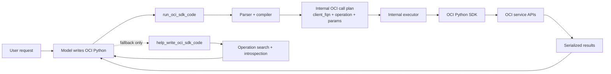

# OCI Python Code MCP Server

## Overview

This experimental server is designed around one model-facing idea:

- write ordinary OCI Python SDK code
- let the server translate and normalize it internally
- never expose the raw internal invoke contract as a public tool

Public tools:

- `run_oci_sdk_code`
- `help_write_oci_sdk_code`

The public surface is intentionally small and Python-oriented.

Preferred model workflow:

1. Start by writing OCI Python SDK code that directly satisfies the user request.
2. Use `run_oci_sdk_code` first.
3. Use `help_write_oci_sdk_code` only when the model does not know what plausible OCI Python to write yet, or when it needs repair help after a failed run.

## Architecture



The key boundary is that models write ordinary OCI Python, while the server compiles that code into internal OCI SDK invocation records. The raw internal invoke contract is not part of the public MCP surface.

## Running the server

### STDIO transport mode

```sh
uvx oracle.oci-python-code-mcp-server
```

### HTTP streaming transport mode

```sh
ORACLE_MCP_HOST=<hostname/IP address> ORACLE_MCP_PORT=<port number> uvx oracle.oci-python-code-mcp-server
```

## Public Tool Surface

### `run_oci_sdk_code`

Compile and optionally execute ordinary OCI Python SDK code.

The execution contract is simple: this tool should only fail when the server cannot translate the snippet into valid OCI SDK invocations with a concrete client FQN, operation name, and JSON-serializable params. Extra Python that does not affect those invocations may be ignored with translation warnings instead of causing the whole run to fail.

The server accepts a constrained Python subset shaped like real OCI SDK usage:

- `import oci`
- `from oci.identity import IdentityClient`
- client construction like `client = IdentityClient(config, signer=signer)`
- direct client calls like `client.list_regions()`
- nested OCI model constructors like `CreateVcnDetails(display_name="demo")`
- short linear procedures with simple value bindings
- setup-derived values like `config["tenancy"]`
- references to earlier step results like `tenancy["id"]`
- simple output shaping like `region_names = [region.name for region in regions.data]`
- a few pure derived builtins like `str(...)`, `int(...)`, `float(...)`, `bool(...)`, and `len(...)`

Example:

```python
import oci

config = oci.config.from_file()
identity = oci.identity.IdentityClient(config)
tenancy = identity.get_tenancy("ocid1.tenancy.oc1..exampleuniqueID")
tenancy_id = tenancy.data["id"]
identity.list_region_subscriptions(tenancy_id=tenancy_id)
```

Example with a final derived output:

```python
import oci

config = oci.config.from_file()
identity = oci.identity.IdentityClient(config)
regions = identity.list_regions()
region_names = [region.name for region in regions.data]
region_names
```

Important constraints:

- Python-shaped, not Python execution
- imports must come from `oci...`
- procedures are linear only and capped at 3 SDK calls
- at most one destructive step is allowed, and it must be final
- non-OCI-Python statements may be ignored if they do not block compilation of extracted OCI SDK calls
- setup code is not executed during translation
- bare `oci.config.from_file()` can be treated as a placeholder for the server's active OCI config when an extracted SDK call needs values like `config["tenancy"]`
- explicit setup variants like `oci.config.from_file(profile_name="OTHER")` are not silently rewritten; if an extracted SDK call depends on them, compilation or parameter resolution fails
- function definitions, lambdas, and `**kwargs` are not part of the compiled OCI SDK subset
- derived Python is intentionally narrow: names, attributes, indexing, simple comparisons/boolean tests, a few pure builtins, and single-generator list comprehensions
- dict keys beginning with `__` are reserved for internal metadata and rejected

When `execute=false`, the tool returns a Python-oriented preview of the planned SDK calls.

### `help_write_oci_sdk_code`

Fallback helper for writing OCI Python when the model is stuck.

You can pass:

- a natural-language task like `list regions`
- a failed or partial OCI Python snippet
- a method reference like `oci.identity.IdentityClient.list_regions`

The helper returns likely Python-oriented matches and enough SDK detail to keep writing code, instead of switching to an internal transport schema.

Example query:

```text
list regions
```

Example match:

```python
oci.identity.IdentityClient.list_regions()
```

Each match includes:

- `method_ref`
- `signature`
- `call_stub`
- `summary`
- `required_params`
- `optional_params`
- `accepted_kwargs`
- `request_model_hints`
- `supports_pagination`

## Authentication and configuration

This server uses the same configuration as the OCI CLI:

- loads configuration from `~/.oci/config` or the profile set by `OCI_CONFIG_PROFILE`
- adds an additional user-agent suffix for MCP telemetry
- prefers a security token signer when `security_token_file` is configured
- otherwise falls back to the API key signer

Use least-privilege IAM policies for the principal behind the server.

## Security model

The server does not execute arbitrary Python or user-authored setup helpers.

It parses a constrained Python AST, extracts OCI SDK invocations, lowers them into internal OCI SDK call steps, and invokes the OCI Python SDK directly. This keeps the model-facing interface familiar while keeping execution auditable and controlled.

## License

Copyright (c) 2026, Oracle and/or its affiliates.

Released under the Universal Permissive License v1.0 as shown at
<https://oss.oracle.com/licenses/upl/>.
