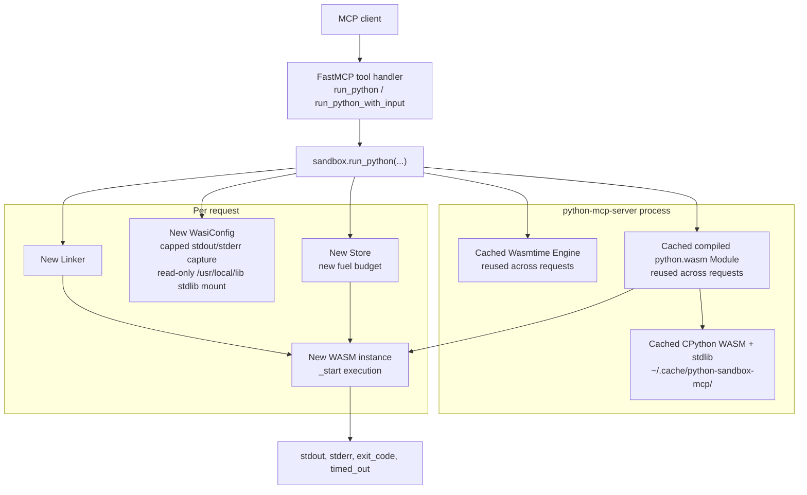

# oracle.python-mcp-server

Python code execution MCP server that runs arbitrary Python code inside a WebAssembly (WASM) sandbox.

The sandbox provides no writable host filesystem access, no network access, and a fuel-based instruction budget to prevent runaway execution. A substantial pure-Python subset of the standard library is available inside the sandbox through a read-only runtime mount.

## Running the Server

### STDIO (default)

```bash
uv run oracle.python-mcp-server
```

### HTTP

```bash
ORACLE_MCP_HOST=0.0.0.0 ORACLE_MCP_PORT=8080 uv run oracle.python-mcp-server
```

## First Run

The first run downloads CPython 3.13 WASM (~30 MB zip) from GitHub, verifies the pinned `python.wasm` SHA-256 digest, and extracts it to `~/.cache/python-sandbox-mcp/`. Override the binary path with:

```bash
PYTHON_WASM_PATH=/path/to/python.wasm uv run oracle.python-mcp-server
```

When `PYTHON_WASM_PATH` is set, the server expects a sibling `lib/` directory next to the `python.wasm` file.

## Tools

| Tool | Description |
|------|-------------|
| `run_python` | Execute Python code in the WASM sandbox, returns stdout, stderr, exit_code, timed_out |
| `run_python_with_input` | Same as run_python but also accepts stdin data |

## Architecture



The server does not keep one long-lived sandbox and reuse it for later executions. It reuses the expensive shared runtime artifacts inside the server process, specifically the Wasmtime `Engine` and compiled `Module`, but each MCP request creates a fresh `Store`, `WasiConfig`, `Linker`, and instantiated WASM sandbox before running `_start`.

## Sandbox Properties

- Pure-Python stdlib modules available via read-only `/usr/local/lib` mount
- Modules that depend on native extension modules in the bundled WASI runtime are unavailable (for example `sqlite3`, `ssl`, `ctypes`, `bz2`)
- No other host filesystem access
- No network access
- Fuel-based timeout: each WASM instruction consumes 1 fuel unit
- Guest linear memory capped at 256 MiB per execution
- Stdin payload capped at 1 MiB per execution
- Captured stdout capped at 1 MiB per execution
- Captured stderr capped at 1 MiB per execution
- Downloaded `python.wasm` verified against a pinned SHA-256 digest before use
- Sandbox lifecycle: cached engine/module across requests, fresh sandbox instance per request

## Security

This server executes arbitrary code. The WASM sandbox ensures that executed code cannot access the host filesystem beyond the read-only stdlib mount, make network calls, or run indefinitely. However, operators should review their deployment environment and apply additional controls as appropriate.

## Security Model And Limitations

Security model:

- Isolation boundary: untrusted Python runs inside a fresh WASM instance for each request, while the Wasmtime `Engine` and compiled `Module` are reused only as immutable runtime artifacts.
- Filesystem scope: only the extracted stdlib is mounted into the guest at `/usr/local/lib` with read-only permissions; no other host paths are preopened.
- Network scope: the guest only receives WASI imports and no host network capability is intentionally exposed.
- CPU control: each execution gets a fresh fuel budget derived from the requested timeout.
- Memory control: each execution runs with a 256 MiB Wasmtime store memory limit.
- Output control: stdout and stderr are captured through capped host callbacks, each limited to 1 MiB per execution.
- Runtime integrity: the bundled `python.wasm` artifact is accepted only if its SHA-256 matches the pinned digest in the server.

Limitations:

- The integrity check is pinned to the extracted `python.wasm` artifact from the configured release, not to the entire downloaded zip archive.
- If `PYTHON_WASM_PATH` is set, the server trusts that user-supplied runtime path and does not apply the pinned digest check automatically.
- The Python Wasmtime bindings used here require stdin to be provided via a file-backed WASI handle, so stdin is staged through a temporary file before execution.
- Modules that require native extension modules from the bundled runtime are unavailable; for example `sqlite3`, `ssl`, `ctypes`, and `bz2` currently fail to import.
- A guest that exceeds the stdout or stderr cap will typically see an I/O error from the WASI stream; output is blocked rather than silently discarded.
- This is still a single-process sandbox design. It is stronger than executing untrusted Python directly on the host, but weaker than layering WASM isolation inside a container or microVM.
- The security boundary depends on the correctness of Wasmtime, WASI, and the bundled CPython WASM runtime.
- If you expose the server over HTTP, you still need transport-level controls such as authentication, authorization, and conservative network binding.

## License

Copyright (c) 2025 Oracle and/or its affiliates.
Licensed under the Universal Permissive License v1.0 as shown at https://oss.oracle.com/licenses/upl.
